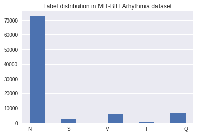
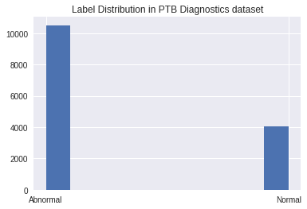
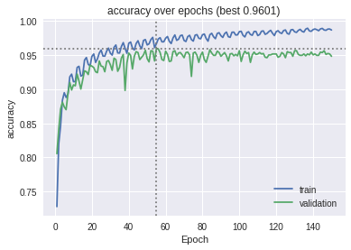
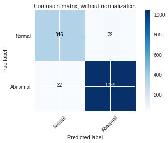
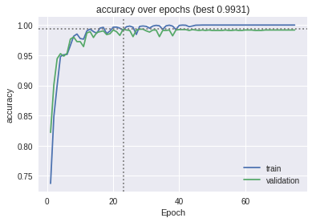
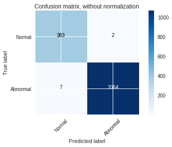
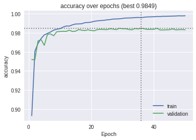
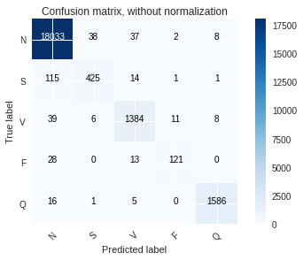
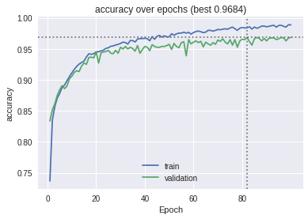

# Advanced-Deep-Learning
This repository includes the project to be completed as part of the course Advanced Deep Learning at Ravensburg-Weingarten University of Applied Sciences.

This project is based on the work in the paper ['ECG Heartbeat Classification: A Deep Transferable Representation'](https://arxiv.org/abs/1805.00794). The PTB Diagnostic ECG Database and the MIT-BIH Arrhythmia dataset are used to train and validate the model. The MIT-BIH dataset has 5 different classes and the PTB Diagnostic dataset has two classes as shown in the figures.

 

The problem statement is an anamoly detection problem where we can use deep learning models to detect the anamolies. Here in this project we try to implement a MLP baseline model and ResNet models and evaluate their performance on the datasets.

# Dependencies

We use tensorflow to implement the deep learning models. Google Colab is used here as it has inbuilt tensorflow libraries and the additional dependencies have been provided as part of the code so when you execute the respective cells the dependencies are installed.

The dataset has to be downloaded from [kaggle](https://www.kaggle.com/shayanfazeli/heartbeat) and has to be uploaded to google drive. When prompted mount the google drive and make sure the path to the dataset is correct to copy the contents to the colab environment.

# Results

The models were trained on the datasets and the following graphs for accuracy and the confusion matrix were obtained.

The MLP baseline model on PTB Diagnostic ECG Database:

The ResNet model on PTB Diagnostic ECG Database:

The ResNet model on MIT-BIH Arrhythmia dataset:

The ResNet model with transfer learning on PTB Diagnostic ECG Database:

# Conclusion

Based on the result obtained we can conclude that the performance of the ResNet model on the PTB Diagnostic ECG Database is the best with an accuracy of 99.66% we can observe this in the confusion matrix where there are very less false positives and false negatives.
